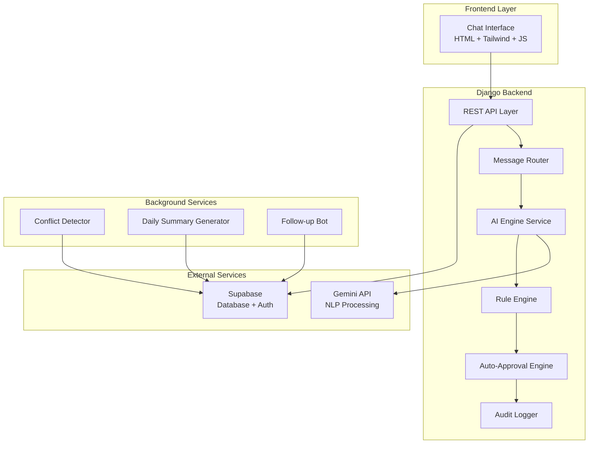
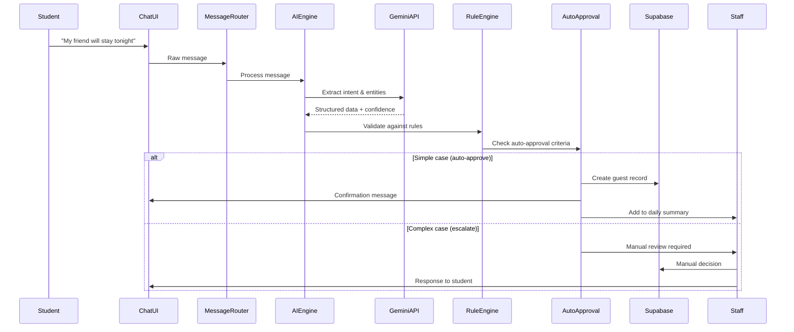

# Design Document: AI-Powered Hostel Coordination System

## Overview

The AI-Powered Hostel Coordination System transforms natural language communication into structured hostel management actions through intelligent automation. The system leverages Google's Gemini API for natural language processing, Django for backend orchestration, and Supabase for data persistence and real-time capabilities.

The core architecture follows a message-driven design where natural language inputs are processed through an AI pipeline that extracts intent, validates against business rules, and either auto-processes simple requests or escalates complex ones to staff. This approach reduces manual workload by approximately 70% while maintaining comprehensive audit trails and conflict detection.

## Architecture

### High-Level Architecture



### Data Flow Architecture



## Components and Interfaces

### 1. AI Engine Service

**Purpose**: Core natural language processing and intent extraction service.

**Key Methods**:

```python
class AIEngineService:
    def extract_intent(self, message: str, user_context: dict) -> IntentResult
    def validate_confidence(self, result: IntentResult) -> bool
    def request_clarification(self, incomplete_data: dict) -> str
    def format_structured_output(self, intent: Intent, entities: List[Entity]) -> dict
```

**Integration Points**:

- Gemini API for NLP processing
- Message Router for input/output
- Rule Engine for validation
- Audit Logger for decision tracking

### 2. Message Router

**Purpose**: Central message processing and routing h# Requirements Document

## Introduction

The AI-Powered Hostel Coordination System transforms unstructured human communication into structured hostel management actions. The system enables natural language interaction between students and staff while automating routine decisions and maintaining comprehensive audit trails. The core philosophy is "Let humans talk naturally. Let AI do the structuring."

## Glossary

- **System**: The AI-Powered Hostel Coordination System
- **AI_Engine**: The Gemini-powered natural language processing component
- **Student**: Hostel residents who send messages and requests
- **Staff**: Wardens, security personnel, and administrators who manage hostel operations
- **Message_Parser**: Component that converts natural language to structured data
- **Auto_Approval_Engine**: Component that processes simple requests without staff intervention
- **Guest_Record**: Structured data representing a guest stay request and approval
- **Absence_Record**: Structured data representing a student's planned absence
- **Daily_Summary**: AI-generated report of hostel activities and status
- **Audit_Log**: Comprehensive record of all AI decisions and their reasoning
- **Conflict_Detector**: Component that identifies scheduling and rule conflicts
- **Rule_Engine**: Component that applies hostel policies to requests

## Requirements

### Requirement 1: AI Message-to-Action Engine

**User Story:** As a student, I want to send natural language messages about my needs, so that the system can automatically understand and process my requests without requiring structured forms.

#### Acceptance Criteria

1. WHEN a student sends a natural language message, THE Message_Parser SHALL extract intent, dates, room information, and confidence levels
2. WHEN message parsing is complete, THE System SHALL convert extracted information into structured JSON format
3. WHEN structured data is created, THE System SHALL route the request to appropriate processing components
4. WHEN parsing confidence is below 80%, THE System SHALL request clarification from the student
5. WHEN a message contains multiple intents, THE System SHALL separate them into individual structured requests

### Requirement 2: Guest Permission Automation

**User Story:** As a student, I want to request guest permissions through natural language, so that simple requests can be processed immediately without waiting for staff approval.

#### Acceptance Criteria

1. WHEN a guest request is received, THE Guest_Permission_System SHALL validate against hostel rules automatically
2. WHEN a guest stay is 1 night or less AND the student has no recent violations, THE Auto_Approval_Engine SHALL approve the request immediately
3. WHEN a guest request exceeds simple criteria, THE System SHALL escalate to staff for manual review
4. WHEN a guest request is approved, THE System SHALL create a Guest_Record and notify security
5. WHEN guest approval occurs, THE System SHALL update the daily summary with the new guest information

### Requirement 3: Auto-Approval Engine

**User Story:** As staff, I want the system to handle routine requests automatically, so that I can focus on complex issues requiring human judgment.

#### Acceptance Criteria

1. WHEN a leave request is 2 days or less, THE Auto_Approval_Engine SHALL process it without staff intervention
2. WHEN a room cleaning request is submitted, THE System SHALL automatically schedule and confirm the service
3. WHEN a basic maintenance issue is reported, THE System SHALL create a work order and notify maintenance staff
4. WHEN auto-approval occurs, THE System SHALL log the decision with full reasoning in the Audit_Log
5. WHEN auto-approval criteria are not met, THE System SHALL route the request to appropriate staff members

### Requirement 4: Daily Summary Generation

**User Story:** As staff, I want to receive comprehensive daily summaries, so that I can quickly understand hostel status and pending issues.

#### Acceptance Criteria

1. WHEN each morning arrives, THE System SHALL generate a Daily_Summary containing student absence counts
2. WHEN generating summaries, THE System SHALL include all active guest stays and their durations
3. WHEN creating daily reports, THE System SHALL list maintenance status and pending work orders
4. WHEN summarizing, THE System SHALL highlight any rule violations detected in the past 24 hours
5. WHEN daily summaries are complete, THE System SHALL deliver them to all relevant staff members

### Requirement 5: Natural Language Query System

**User Story:** As staff, I want to query the system using natural language, so that I can quickly find information without learning complex database commands.

#### Acceptance Criteria

1. WHEN staff submits a natural language query, THE AI_Engine SHALL convert it to appropriate database operations
2. WHEN database queries are executed, THE System SHALL format results in clear, readable format
3. WHEN query results are ambiguous, THE System SHALL ask clarifying questions to narrow the search
4. WHEN no results are found, THE System SHALL suggest alternative search terms or related information
5. WHEN queries involve sensitive information, THE System SHALL verify staff authorization before displaying results

### Requirement 6: Rule Explanation System

**User Story:** As a student, I want to ask questions about hostel rules, so that I can understand policies and create appropriate requests.

#### Acceptance Criteria

1. WHEN a student asks about hostel rules, THE Rule_Engine SHALL provide clear explanations with examples
2. WHEN rule explanations are provided, THE System SHALL offer to create relevant requests if applicable
3. WHEN students ask about specific scenarios, THE System SHALL explain how rules apply to their situation
4. WHEN rule information is requested, THE System SHALL cite specific policy sections and effective dates
5. WHEN rule explanations are complete, THE System SHALL log the interaction for policy improvement analysis

### Requirement 7: Conflict Detection System

**User Story:** As staff, I want the system to automatically detect scheduling and rule conflicts, so that problems are identified before they cause operational issues.

#### Acceptance Criteria

1. WHEN nightly conflict checks run, THE Conflict_Detector SHALL identify double room assignments
2. WHEN checking for conflicts, THE System SHALL detect absent students with approved guests present
3. WHEN analyzing room status, THE System SHALL identify maintenance rooms that are incorrectly occupied
4. WHEN rule violations are detected, THE System SHALL generate automatic alerts to appropriate staff
5. WHEN conflicts are found, THE System SHALL suggest resolution actions and priority levels

### Requirement 8: Follow-up Bot System

**User Story:** As a student, I want the system to help me complete incomplete requests, so that I don't need to wait for staff to ask clarifying questions.

#### Acceptance Criteria

1. WHEN a message lacks required information, THE Follow_up_Bot SHALL ask specific clarifying questions
2. WHEN students provide partial responses, THE System SHALL continue the conversation until complete
3. WHEN follow-up conversations exceed 3 exchanges, THE System SHALL escalate to staff assistance
4. WHEN clarification is complete, THE System SHALL process the original request automatically
5. WHEN follow-up interactions occur, THE System SHALL maintain conversation context throughout the exchange

### Requirement 9: Audit Log System

**User Story:** As an administrator, I want comprehensive logs of all AI decisions, so that I can ensure transparency and improve system performance.

#### Acceptance Criteria

1. WHEN any AI decision is made, THE System SHALL record the decision with complete reasoning in the Audit_Log
2. WHEN logging decisions, THE System SHALL include confidence scores and rule applications used
3. WHEN audit entries are created, THE System SHALL timestamp all actions and associate them with specific users
4. WHEN staff reviews audit logs, THE System SHALL provide searchable and filterable access to all entries
5. WHEN audit data is accessed, THE System SHALL maintain data integrity and prevent unauthorized modifications

### Requirement 10: Chat-Based Interface

**User Story:** As a user, I want to interact with the system through a familiar chat interface, so that adoption is high and the learning curve is minimal.

#### Acceptance Criteria

1. WHEN users access the system, THE Interface SHALL provide a WhatsApp-like chat experience
2. WHEN messages are sent, THE System SHALL store complete conversation history for all users
3. WHEN displaying conversations, THE Interface SHALL show message timestamps and delivery status
4. WHEN users interact with the chat, THE System SHALL provide real-time typing indicators and message status
5. WHEN chat sessions are active, THE System SHALL maintain responsive performance with sub-2-second response times

### Requirement 11: Data Integration and Storage

**User Story:** As a system administrator, I want all data properly stored and integrated, so that the system maintains data integrity and supports all required operations.

#### Acceptance Criteria

1. WHEN structured data is created, THE System SHALL store it in Supabase with proper schema validation
2. WHEN data is stored, THE System SHALL maintain referential integrity between students, guests, and requests
3. WHEN database operations occur, THE System SHALL handle concurrent access and maintain consistency
4. WHEN data is retrieved, THE System SHALL provide efficient querying with appropriate indexing
5. WHEN system integration occurs, THE Django_Backend SHALL properly interface with both Supabase and Gemini_API

### Requirement 12: Security and Authentication

**User Story:** As a system administrator, I want proper security controls, so that sensitive hostel data is protected and access is appropriately controlled.

#### Acceptance Criteria

1. WHEN users access the system, THE System SHALL authenticate them using secure methods
2. WHEN API calls are made to Gemini, THE System SHALL protect the API key and use secure transmission
3. WHEN sensitive data is stored, THE System SHALL encrypt it both in transit and at rest
4. WHEN staff access privileged functions, THE System SHALL verify appropriate authorization levels
5. WHEN security events occur, THE System SHALL log them for monitoring and audit purposesub.

**Key Methods**:

```python
class MessageRouter:
    def route_message(self, message: Message) -> ProcessingResult
    def handle_student_message(self, message: StudentMessage) -> Response
    def handle_staff_query(self, query: StaffQuery) -> QueryResult
    def manage_conversation_context(self, user_id: str) -> ConversationContext
```

**Responsibilities**:

- Message classification and routing
- Conversation context management
- Response formatting and delivery
- Error handling and fallback processing

### 3. Rule Engine

**Purpose**: Business rule validation and policy enforcement.

**Key Methods**:

```python
class RuleEngine:
    def validate_guest_request(self, request: GuestRequest) -> ValidationResult
    def check_leave_policy(self, leave: LeaveRequest) -> PolicyResult
    def evaluate_auto_approval_criteria(self, request: Request) -> ApprovalDecision
    def explain_rule(self, rule_query: str) -> RuleExplanation
```

**Rule Categories**:

- Guest stay duration limits
- Student violation history checks
- Room occupancy constraints
- Maintenance scheduling rules

### 4. Auto-Approval Engine

**Purpose**: Automated decision making for routine requests.

**Auto-Approval Criteria**:

- Guest stays ≤ 1 night with clean student record
- Leave requests ≤ 2 days with proper notice
- Room cleaning requests during available hours
- Basic maintenance issues with clear categorization

**Key Methods**:

```python
class AutoApprovalEngine:
    def evaluate_request(self, request: Request) -> ApprovalDecision
    def create_guest_record(self, approved_request: GuestRequest) -> GuestRecord
    def schedule_maintenance(self, maintenance_request: MaintenanceRequest) -> WorkOrder
    def log_decision(self, decision: ApprovalDecision) -> AuditEntry
```

### 5. Conflict Detection System

**Purpose**: Proactive identification of scheduling and rule conflicts.

**Detection Patterns**:

- Double room assignments
- Absent students with active guests
- Maintenance rooms marked as occupied
- Policy violations across multiple requests

**Key Methods**:

```python
class ConflictDetector:
    def run_nightly_checks(self) -> List[Conflict]
    def detect_room_conflicts(self) -> List[RoomConflict]
    def identify_policy_violations(self) -> List[PolicyViolation]
    def generate_resolution_suggestions(self, conflicts: List[Conflict]) -> List[Resolution]
```

### 6. Daily Summary Generator

**Purpose**: Automated reporting and status summarization.

**Summary Components**:

- Student absence counts and durations
- Active guest stays and approvals
- Maintenance work orders and status
- Rule violations and staff actions required
- System performance metrics

**Key Methods**:

```python
class DailySummaryGenerator:
    def generate_morning_summary(self, date: datetime) -> DailySummary
    def compile_absence_report(self) -> AbsenceReport
    def summarize_guest_activity(self) -> GuestReport
    def highlight_urgent_items(self) -> List[UrgentItem]
```

## Data Models

### Core Entities

```python
# Student and Staff Models
class Student(models.Model):
    student_id = models.CharField(max_length=20, unique=True)
    name = models.CharField(max_length=100)
    room_number = models.CharField(max_length=10)
    block = models.CharField(max_length=5)
    phone = models.CharField(max_length=15)
    violation_count = models.IntegerField(default=0)
    last_violation_date = models.DateTimeField(null=True)
    created_at = models.DateTimeField(auto_now_add=True)

class Staff(models.Model):
    staff_id = models.CharField(max_length=20, unique=True)
    name = models.CharField(max_length=100)
    role = models.CharField(max_length=20)  # warden, security, admin
    permissions = models.JSONField(default=dict)
    created_at = models.DateTimeField(auto_now_add=True)

# Request and Record Models
class Message(models.Model):
    message_id = models.UUIDField(default=uuid.uuid4, unique=True)
    sender = models.ForeignKey(Student, on_delete=models.CASCADE)
    content = models.TextField()
    processed = models.BooleanField(default=False)
    confidence_score = models.FloatField(null=True)
    extracted_intent = models.JSONField(null=True)
    created_at = models.DateTimeField(auto_now_add=True)

class GuestRequest(models.Model):
    request_id = models.UUIDField(default=uuid.uuid4, unique=True)
    student = models.ForeignKey(Student, on_delete=models.CASCADE)
    guest_name = models.CharField(max_length=100)
    start_date = models.DateTimeField()
    end_date = models.DateTimeField()
    status = models.CharField(max_length=20)  # pending, approved, rejected
    auto_approved = models.BooleanField(default=False)
    approval_reason = models.TextField()
    created_at = models.DateTimeField(auto_now_add=True)

class AbsenceRecord(models.Model):
    absence_id = models.UUIDField(default=uuid.uuid4, unique=True)
    student = models.ForeignKey(Student, on_delete=models.CASCADE)
    start_date = models.DateTimeField()
    end_date = models.DateTimeField()
    reason = models.TextField()
    status = models.CharField(max_length=20)
    auto_approved = models.BooleanField(default=False)
    created_at = models.DateTimeField(auto_now_add=True)

class AuditLog(models.Model):
    log_id = models.UUIDField(default=uuid.uuid4, unique=True)
    action_type = models.CharField(max_length=50)
    entity_type = models.CharField(max_length=50)
    entity_id = models.CharField(max_length=100)
    decision = models.CharField(max_length=20)
    reasoning = models.TextField()
    confidence_score = models.FloatField()
    rules_applied = models.JSONField()
    user_id = models.CharField(max_length=50)
    timestamp = models.DateTimeField(auto_now_add=True)
```

### Supabase Schema Design

```sql
-- Core tables with Row Level Security
CREATE TABLE students (
    id UUID PRIMARY KEY DEFAULT gen_random_uuid(),
    student_id VARCHAR(20) UNIQUE NOT NULL,
    name VARCHAR(100) NOT NULL,
    room_number VARCHAR(10) NOT NULL,
    block VARCHAR(5) NOT NULL,
    phone VARCHAR(15),
    violation_count INTEGER DEFAULT 0,
    last_violation_date TIMESTAMPTZ,
    created_at TIMESTAMPTZ DEFAULT NOW()
);

CREATE TABLE guest_requests (
    id UUID PRIMARY KEY DEFAULT gen_random_uuid(),
    student_id UUID REFERENCES students(id),
    guest_name VARCHAR(100) NOT NULL,
    start_date TIMESTAMPTZ NOT NULL,
    end_date TIMESTAMPTZ NOT NULL,
    status VARCHAR(20) DEFAULT 'pending',
    auto_approved BOOLEAN DEFAULT FALSE,
    approval_reason TEXT,
    created_at TIMESTAMPTZ DEFAULT NOW()
);

-- Enable Row Level Security
ALTER TABLE students ENABLE ROW LEVEL SECURITY;
ALTER TABLE guest_requests ENABLE ROW LEVEL SECURITY;

-- RLS Policies
CREATE POLICY "Students can view own data" ON students
    FOR SELECT USING (auth.uid()::text = student_id);

CREATE POLICY "Staff can view all data" ON students
    FOR ALL USING (
        EXISTS (
            SELECT 1 FROM staff
            WHERE staff_id = auth.uid()::text
            AND role IN ('warden', 'admin')
        )
    );
```

## Correctness Properties

_A property is a characteristic or behavior that should hold true across all valid executions of a system—essentially, a formal statement about what the system should do. Properties serve as the bridge between human-readable specifications and machine-verifiable correctness guarantees._

Before defining the correctness properties, I need to analyze the acceptance criteria from the requirements to determine which ones are testable as properties.

<function_calls>
<invoke name="prework">
<parameter name="featureName">ai-hostel-coordination

## Correctness Properties

_A property is a characteristic or behavior that should hold true across all valid executions of a system—essentially, a formal statement about what the system should do. Properties serve as the bridge between human-readable specifications and machine-verifiable correctness guarantees._

### Property 1: Message Processing Pipeline Integrity

_For any_ natural language message from a student, the system should extract structured intent data, convert it to valid JSON format, and route it to the appropriate processing component based on the extracted intent type.
**Validates: Requirements 1.1, 1.2, 1.3**

### Property 2: Confidence-Based Clarification

_For any_ message parsing result with confidence below 80%, the system should request specific clarification from the student rather than proceeding with uncertain data.
**Validates: Requirements 1.4**

### Property 3: Multi-Intent Message Separation

_For any_ message containing multiple distinct intents, the system should separate them into individual structured requests that can be processed independently.
**Validates: Requirements 1.5**

### Property 4: Auto-Approval Rule Consistency

_For any_ request that meets simple criteria (guest stays ≤1 night with clean record, leaves ≤2 days, basic maintenance, room cleaning), the system should auto-approve without staff intervention and log the decision.
**Validates: Requirements 2.2, 3.1, 3.2, 3.3**

### Property 5: Rule Validation Completeness

_For any_ guest request received by the system, it should be automatically validated against all applicable hostel rules before any approval decision is made.
**Validates: Requirements 2.1**

### Property 6: Escalation Logic Consistency

_For any_ request that exceeds simple auto-approval criteria or fails auto-approval rules, the system should route it to appropriate staff members for manual review.
**Validates: Requirements 2.3, 3.5**

### Property 7: Approval Workflow Completeness

_For any_ approved guest request, the system should create a complete guest record, notify security, and update the daily summary with the new information.
**Validates: Requirements 2.4, 2.5**

### Property 8: Daily Summary Completeness

_For any_ daily summary generation, the report should include all active guest stays, maintenance status, recent rule violations, and be delivered to all relevant staff members.
**Validates: Requirements 4.2, 4.3, 4.4, 4.5**

### Property 9: Natural Language Query Processing

_For any_ natural language query from staff, the system should convert it to appropriate database operations, format results clearly, and handle edge cases (no results, ambiguous queries) with helpful responses.
**Validates: Requirements 5.1, 5.2, 5.3, 5.4**

### Property 10: Authorization Enforcement

_For any_ query involving sensitive information, the system should verify staff authorization levels before displaying results.
**Validates: Requirements 5.5**

### Property 11: Rule Explanation Completeness

_For any_ student question about hostel rules, the system should provide clear explanations with examples, cite specific policy sections, offer to create relevant requests when applicable, and log the interaction.
**Validates: Requirements 6.1, 6.2, 6.3, 6.4, 6.5**

### Property 12: Comprehensive Conflict Detection

_For any_ nightly conflict check, the system should identify all types of conflicts (double room assignments, absent students with guests, maintenance room occupancy) and generate appropriate alerts with resolution suggestions.
**Validates: Requirements 7.1, 7.2, 7.3, 7.4, 7.5**

### Property 13: Follow-up Conversation Management

_For any_ incomplete message, the system should ask clarifying questions, maintain conversation context, continue until complete information is gathered, and escalate to staff if conversations exceed 3 exchanges.
**Validates: Requirements 8.1, 8.2, 8.3, 8.4, 8.5**

### Property 14: Comprehensive Audit Logging

_For any_ AI decision made by the system, a complete audit entry should be created with decision reasoning, confidence scores, rules applied, timestamps, and user associations, with all entries remaining tamper-proof and searchable.
**Validates: Requirements 9.1, 9.2, 9.3, 9.4, 9.5**

### Property 15: Message Storage and Display Integrity

_For any_ message sent through the chat interface, it should be stored with complete conversation history and displayed with accurate timestamps and delivery status.
**Validates: Requirements 10.2, 10.3**

### Property 16: Data Storage and Integrity

_For any_ structured data created by the system, it should be stored in Supabase with proper schema validation while maintaining referential integrity between all related entities (students, guests, requests).
**Validates: Requirements 11.1, 11.2**

### Property 17: System Integration Reliability

_For any_ system operation requiring external services, the Django backend should properly interface with both Supabase and Gemini API with appropriate error handling and retry logic.
**Validates: Requirements 11.5**

### Property 18: Authentication and Authorization Security

_For any_ user attempting to access the system, authentication should be enforced using secure methods, and staff accessing privileged functions should have their authorization levels verified.
**Validates: Requirements 12.1, 12.4**

### Property 19: API Security and Data Protection

_For any_ API call to Gemini or sensitive data operation, the system should protect API keys, use secure transmission, encrypt sensitive data in transit and at rest, and log all security events.
**Validates: Requirements 12.2, 12.3, 12.5**

## Error Handling

### AI Processing Errors

**Gemini API Failures**:

- Implement exponential backoff retry logic (3 attempts)
- Fallback to rule-based parsing for simple patterns
- Queue messages for later processing during extended outages
- Notify staff of AI service degradation

**Low Confidence Parsing**:

- Threshold: 80% confidence required for auto-processing
- Below threshold: Initiate clarification conversation
- Multiple clarification failures: Escalate to staff
- Log all low-confidence interactions for model improvement

### Database and Integration Errors

**Supabase Connection Issues**:

- Connection pooling with automatic retry
- Local caching for read operations during outages
- Write operation queuing with eventual consistency
- Real-time sync recovery after reconnection

**Data Validation Failures**:

- Schema validation at API boundary
- Graceful degradation for non-critical fields
- User-friendly error messages for validation failures
- Automatic data sanitization and format correction

### Business Logic Errors

**Rule Engine Conflicts**:

- Conflict resolution through priority-based rules
- Staff notification for unresolvable conflicts
- Temporary manual override capabilities
- Audit trail for all conflict resolutions

**Auto-Approval Edge Cases**:

- Fallback to manual review for edge cases
- Clear escalation paths for unusual requests
- Time-based escalation for pending requests
- Emergency override procedures for urgent cases

## Testing Strategy

### Dual Testing Approach

The system requires both **unit testing** and **property-based testing** for comprehensive coverage:

**Unit Tests** focus on:

- Specific examples of message parsing scenarios
- Edge cases in rule validation logic
- Integration points between Django and external services
- Error conditions and fallback behaviors
- Authentication and authorization workflows

**Property-Based Tests** focus on:

- Universal properties that hold across all inputs
- Comprehensive input coverage through randomization
- Correctness properties defined in the design document
- Minimum 100 iterations per property test for statistical confidence

### Property-Based Testing Configuration

**Framework Selection**: Use **Hypothesis** for Python-based property testing

- Integrates well with Django test framework
- Excellent support for generating complex test data
- Built-in shrinking for minimal failing examples

**Test Configuration**:

- Minimum 100 iterations per property test
- Each property test references its design document property
- Tag format: **Feature: ai-hostel-coordination, Property {number}: {property_text}**
- Custom generators for domain-specific data (student records, messages, requests)

**Example Property Test Structure**:

```python
from hypothesis import given, strategies as st
import pytest

@given(st.text(min_size=10, max_size=200))
def test_message_processing_pipeline_integrity(message_text):
    """
    Feature: ai-hostel-coordination, Property 1: Message Processing Pipeline Integrity
    For any natural language message, the system should extract structured intent data,
    convert to JSON, and route appropriately.
    """
    # Test implementation here
    pass
```

### Integration Testing Strategy

**End-to-End Scenarios**:

- Complete message-to-action workflows
- Multi-user concurrent access patterns
- External service integration reliability
- Real-time notification delivery

**Performance Testing**:

- Response time requirements (sub-2-second for chat)
- Concurrent user load testing
- Database query optimization validation
- Gemini API rate limit handling

**Security Testing**:

- Authentication bypass attempts
- Authorization privilege escalation tests
- API key protection validation
- Data encryption verification
- SQL injection and XSS prevention
